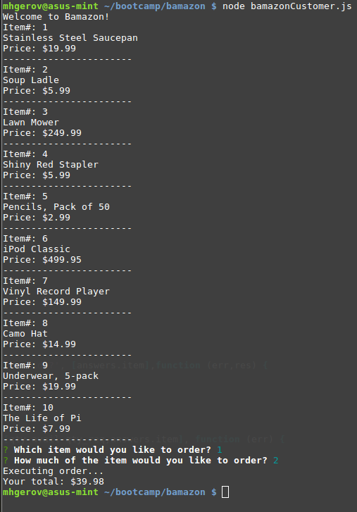

# bamazon

## bamazonCustomer
Bamazon is a demo app of MySQL/Node that takes in orders via command-line and updates the SQL database accordingly. `bamazon_db_seed.sql` will initialize and seed a product database on the local MySQL/MariaDB server. Use a .env file for logging into the SQL server.
